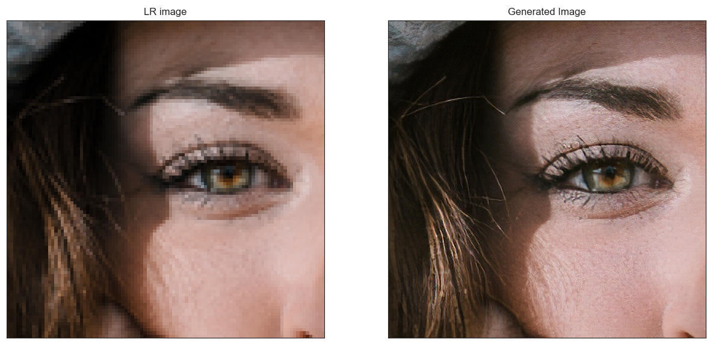

# Single Image Super-Resolution (SISR) with SRResNet, EDSR and SRGAN


### **->Try it on your own images [here](https://thesuperme.herokuapp.com/).**
## Introduction

Image super-resolution (SR) is the process of recovering high-resolution (HR) images from low-resolution (LR) images. It is an important class of image processing techniques in computer vision and image processing and enjoys a wide range of real-world applications, such as medical imaging, satellite imaging, surveillance and security, astronomical imaging, amongst others.

With the advancement in deep learning techniques in recent years, deep learning-based SR models have been actively explored and often achieve state-of-the-art performance on various benchmarks of SR. A variety of deep learning methods have been applied to solve SR tasks, ranging from the early Convolutional Neural Networks (CNN) based method to recent promising Generative Adversarial Nets based SR approaches.

A more detailed overview on single image super-resolution is given in [this paper](https://arxiv.org/abs/1808.03344).

This repo contains a tensorflow-based implementation of:
- [Enhanced Deep Residual Networks for Single Image Super-Resolution](https://arxiv.org/abs/1707.02921)
- [Photo-Realistic Single Image Super-Resolution Using a Generative Adversarial Network](https://arxiv.org/abs/1609.04802)

## Model Architecture
### **SRResNet**
SRResNet adopts the design of ResNet to solve issues with training very deep models. it managed to achieve state-of-the-art performance when it came out. it contains 16 residual blocks and uses mean squared error as a loss function Here’s an overview of the SRResNet architecture:
<p align="center">

</p>

### **EDSR**
One super-resolution model that follows this high-level architecture is described in the paper [Enhanced Deep Residual Networks for Single Image Super-Resolution](https://arxiv.org/abs/1707.02921) (EDSR). It is a winner of the NTIRE 2017 super-resolution challenge. They further improved the performance by employing a better ResNet structure: Batch Normalization layers are removed, and instead of mean squared error, mean absolute error is used as a loss function. Here’s an overview of the EDSR architecture:

<p align="center">

</p>

### **SRGAN**
SRGAN further improves the results of SRResNet by fine-tuning its weights so that it can generate high frequency details in the generated image. This is done by training the model in a GAN using ***Perceptual*** loss function , which consists of two components:
- Content Loss: compares deep features extracted from SR and HR images with a pre-trained [VGG network](https://arxiv.org/abs/1409.1556). With  φi,j we indicate the feature map obtained by the j-th convolution (after activation) before the i-th maxpooling layer within the VGG19 network

<p align="center">

</p>

Here Wi,j and Hi,j describe the dimensions of the
respective feature maps within the VGG network.

- Adversarial Loss:  The GAN discriminator D is optimized for discriminating SR from HR images whereas the generator is optimized for generating more realistic SR images in order to fool the discriminator.

<p align="center">

</p>

Perceptual loss is the weighted sum of content loss and adversarial loss:

<p align="center">

</p>

And here's an overview of the discriminator architecture:

<p align="center">

</p>

This project aims to fine-tune EDSR model instead of SRResNet in the same manner.

## Results
<p align="center">

</p>

<p align="center">

</p>

<p align="center">

</p>

<p align="center">

</p>

## Environment setup
```
# using pip
pip install -r requirements.txt

# using Conda
conda create --name <env_name> --file requirements.txt
```

## Training and testing
You can try training the models yourself by executing train.py

```
python train.py
```
This will download DIV2K dataset, preprocess it and start training EDSR then fine-tuning it in SRGAN.

If you want to train the model with different dataset, pass its path as an argument.
```
python train.py <path/to/dataset>
```
the dataset directory should have a 'HR' folder which contains high resolution images, and a 'LR' folder which contains low resolution images.

And if you'd like to test our model on an image, you can execute resolve_image.py and pass the image path as an argument. The output will be saved in the 'results' directory.

```
python resolve_image.py <path/to/the/image>
```
Or you can easily use our web interface by going [here](https://thesuperme.herokuapp.com/).